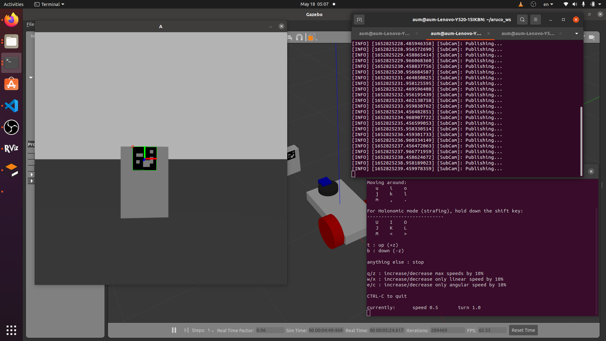

# ArUcoPoseEstimationROS2
First change models/box(cylinder)/meshes/model.mtl    
/home/aum/aruco_ws/src/aruco/models/box/materials/textures/texture.png    
to your texture.png path    
    
going to your workspace
```
colcon build
```
Then sorce your workspace
```
~/yourworkspace/install/setup.bash
```
then launch gazebo and rviz by use this command
```
ros2 launch aruco launch.py
```
You will have 
1. gazebo and rviz with differential drive robot with camera
2. Box and Cylinder with ArUco mark in gazebo
like this

    
Then source workspace in another terminal and run pose estimation node by run sub_cam.py
```
ros2 run aruco sub_cam.py
```
You will have camera frame window like this

 You will have marker info from terminal that consists of Id, TranslationVector(XYZ), EulerAngle(RPY), RotationMatrix and Quaternion of objects in camera frame.
 These store in Dictionary name "Marker" variable
 Camera frame are X right Y Down Z Out of the camera
