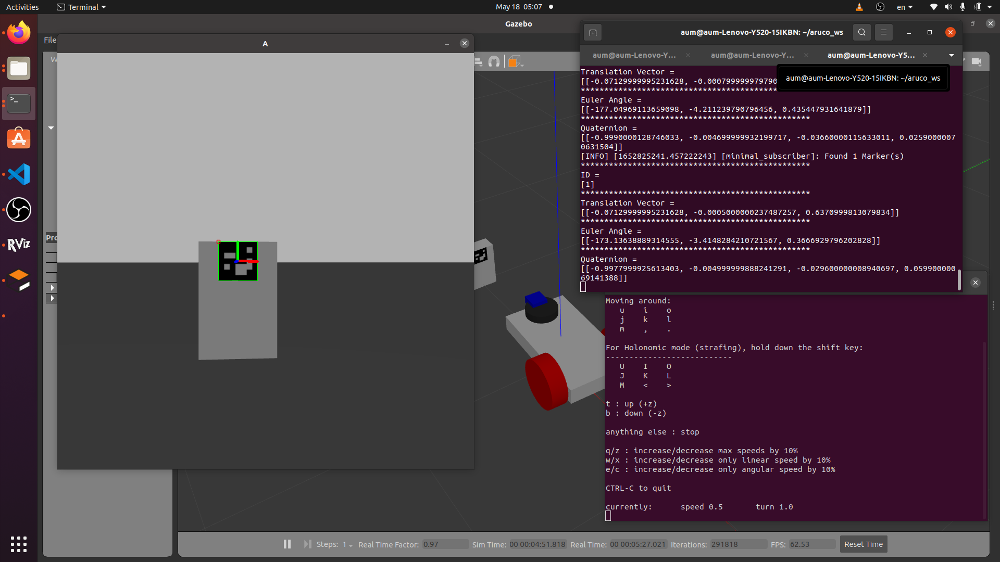

# ArUcoPoseEstimationROS2
going to your workspace and build your workspace
```
cd ~/[yourworkspace]
colcon build
```
Then sorce your workspace
```
~/[yourworkspace]/install/setup.bash
```
then launch gazebo and rviz by use this launch file
```
ros2 launch aruco launch.py
```
You will have 
1. gazebo and rviz with differential drive robot with camera
2. Box and Cylinder with ArUco mark in gazebo
like this

    
Next we will visualizing camera node by open another terminal source your workspace and run pose estimation node by run sub_cam.py
```
~/[yourworkspace]/install/setup.bash
ros2 run aruco sub_cam.py
```
You will have camera frame window like this and output in terminal "Publishing..."

 This node is publishing marker info that consists of Id, TranslationVector(XYZ), EulerAngle(RPY), RotationMatrix and Quaternion of objects in camera frame.
 These store in Dictionary name "Marker"
 Camera frame are X right Y Down Z Out of the camera
    
 You can use teleop keyboard to move the robot by open new terminal and run
 ```
 ros2 run teleop_twist_keyboard teleop_twist_keyboard
```
    
Custom msg structure can see in /msg/Custom.msg the messages consist of
1. ID: uint16 array size 1*n [1,2]
2. Translation Vector: float array size 1*3n [x1,y1,z1,x2,y2,z2]
3. Euler Angle: float array size 1*3n [r1,p1,y1,r2,p2,y2]
4. Quaternion: float array size 1*4n [qx1,qy1,qz1,qw1,qx2,qx3,qx4]
while n is number of markers found.

Custom message publish in to topic "/HouseM8/Aruco" that you can see by echo this topic
```
ros2 topic echo /HouseM8/Aruco
```
Next we have an example node to subscibing message from /HouseM8/Aruco topic by sub_aruco.py    
You have to run this node after sub_cam.py success.    
```
~/[yourworkspace]/install/setup.bash
ros2 run aruco sub_aruco.py
```
In python code, you will have variable that collected all of the messages in list this
1. Id: [1,2,...]
2. Translation Vector: [[x1,y1,z1],[x2,y2,z2],...]
3. Euler Angle: [[r1,p1,y1],[r2,p2,y2],...]
4. Quaternion: [[qx1,qy1,qz1,qw1],[qx2,qy2,qz2,qw2],...]

